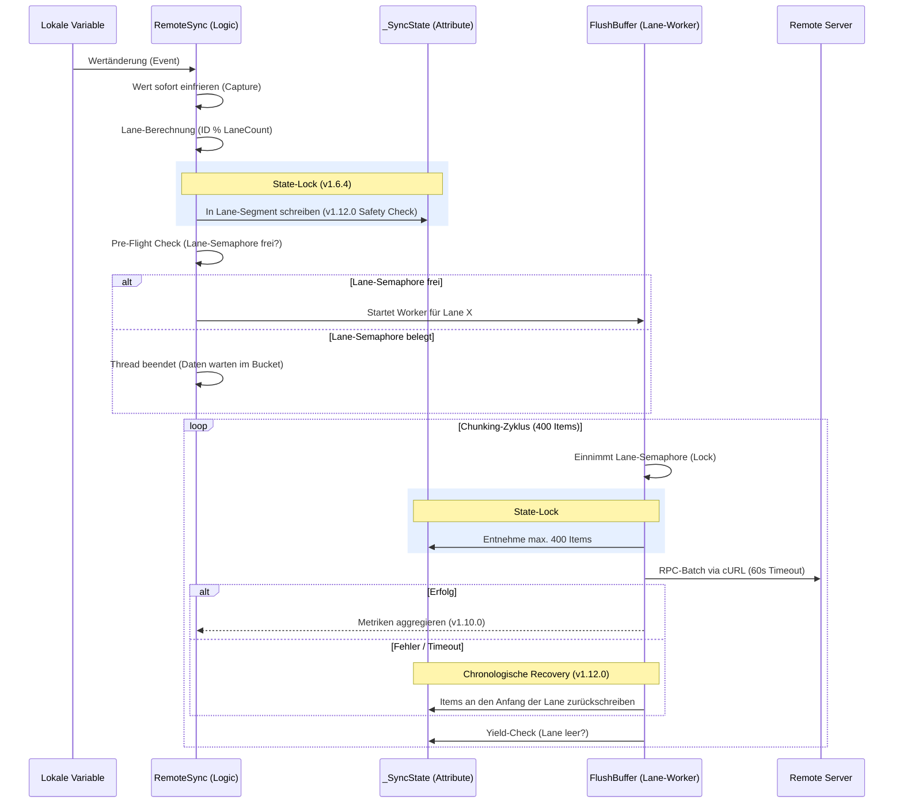
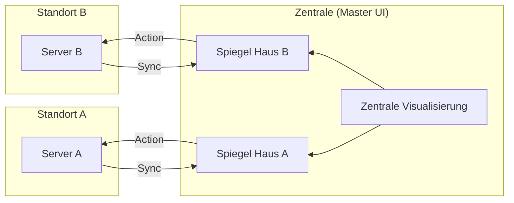
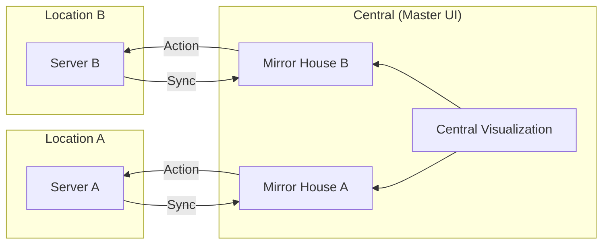

# Hochperformante, bidirektionale Synchronisierung von Variablen-Strukturen zwischen entfernten IP-Symcon Systemen

## 1. Einführung & Problemstellung

In komplexen IP-Symcon-Umgebungen mit mehreren Standorten (z. B. Haupthaus, Gartenhaus, Büro) stellt die Synchronisation von Daten eine Herausforderung dar. Klassische Lösungen leiden oft unter:

- **Hoher Netzwerklast:** Viele Einzel-RPC-Aufrufe verzögern das System.
- **Wartungsaufwand:** Manuelles Anlegen von Variablen und Profilen auf Zielsystemen ist fehleranfällig.
- **Fehlende Interaktion:** Reine Visualisierung von Werten reicht meist nicht aus; eine Steuerung zurück zum Quellsystem ist oft komplex zu realisieren.

## 2. Die Lösung: Das RemoteSync-Prinzip (v1.12.0)

RemoteSync fungiert als intelligente Brücke, die nicht nur Daten überträgt, sondern die Logik zur Steuerung direkt mitliefert ("Injected Gateway"). **Version 1.12.0** führt das hocheffiziente **Multi-Lane-Modell** sowie Mechanismen zur absoluten Datensicherheit bei Leitungsausfällen ein.

- **Autonomes Worker-Modell:** Das Modul nutzt ein event-getriebenes System mit Semaphoren auf Server-Ebene. Seit v1.6.1 arbeitet das Modul vollständig asynchron und timer-frei.
- **Multi-Lane-Parallelismus (v1.9.0):** Daten werden auf mehrere parallele Übertragungswege (Lanes) verteilt. Dies verhindert, dass eine einzelne hochfrequente Variable den gesamten Sync-Prozess blockiert.
- **Aggregiertes Metriken-Modell (v1.10.0):** Performance-Daten werden über ein einstellbares Intervall gesammelt und als Durchschnittswerte veröffentlicht, um die Systemlast zu minimieren.
- **Safety Circuit Breaker (v1.12.0):** Ein einstellbares Puffer-Limit (`MaxBufferSize`) schützt den Arbeitsspeicher vor Überlastung bei langandauernden Leitungsausfällen.
- **Chronologische Recovery (v1.12.0):** Gescheiterte Übertragungen werden automatisch an den Anfang der Lane zurückgeschrieben, ohne neuere Werte zu überschreiben.
- **Atomares State-Locking (v1.6.4):** Zur Vermeidung von Race Conditions nutzt das Modul einen internen State-Lock (`RS_StateLock`), der den Zugriff auf den Puffer threadsicher regelt.
- **Echtzeit-Event-Erfassung (v1.6.3):** Werte werden im Moment des Events direkt eingefroren ("Captured").
- **Full-History / Anti-Conflation (v1.6.2):** Optional lückenlose Historie aller Änderungen. Seit v1.11.6 durch eindeutige History-Keys im Puffer geschützt.
- **cURL-Transport-Layer (v1.9.9):** Hochstabiler Versand mit präzisen Timeouts via cURL.
- **Profil-Replikation:** Lokale Variablenprofile werden automatisch auf dem Zielsystem erstellt.
- **Unified Dashboard:** Ermöglicht die Zusammenführung vieler Quell-Systeme in einer einzigen Benutzeroberfläche (Symcon UI / IPSView).

## 3. Datenfluss & Architektur

### A. Synchronisations-Ablauf (Logik v1.12.0)

### B. Worker-Modell & Parallelität

RemoteSync nutzt System-Semaphoren zur Steuerung der Parallelität auf Basis des **Ziel-Servers (Folder Name)** sowie der **Lane-ID** (v1.9.0). Dies garantiert, dass pro Lane immer genau eine Verbindung aktiv ist, was den Netzwerk-Overhead massiv reduziert, während verschiedene Lanes desselben Servers parallel arbeiten können.

### C. Das "Unified Dashboard" (N:1 Föderation)

## 4. Dateneffizienz & Gruppierungslogik

### A. Das "Last-Value-Wins" Prinzip

Um die Netzwerklast zu minimieren, bereinigt RemoteSync den Puffer pro Server automatisch. Befinden sich mehrere Aktualisierungen derselben Variable gleichzeitig im Bucket, wird im Standardmodus nur der **zuletzt erfasste Wert** übertragen. Seit **v1.6.2** kann über die Option **"Full History"** eine lückenlose Übertragung erzwungen werden, die seit **v1.11.6** durch persistente Keys auch bei Verbindungsabbrüchen geschützt ist.

### B. Gruppierung nach Servern & Lanes (v1.9.0)

Die Zusammenfassung erfolgt nach den definierten **Targets (Folder)** und wird innerhalb dieser auf die konfigurierten **Lanes** verteilt. Ein langsames Netzwerk zu _Server A_ beeinträchtigt niemals die Geschwindigkeit zu _Server B_.

### C. Garantierte Chronologie (v1.12.0)

Das System garantiert eine strikte Sequenzierung. Durch die **Prepend-Logik (v1.12.0)** werden gescheiterte Pakete bei der Recovery wieder an den Anfang des Puffers gestellt, sodass die zeitliche Abfolge auch nach einem Timeout erhalten bleibt.

## 5. Performance Monitoring (Aggregiert v1.10.0)

Über das `PerformanceInterval` werden die Sensoren aktualisiert:

- **RTT (ms):** Durchschnittliche Dauer der Netzwerk-Transaktion.
- **Batch Size (Items):** Summe der Änderungen im Intervall.
- **Payload Size (KB):** Summe der übertragenen Datenmenge.
- **Errors (Count):** Kumulativer Zähler für Fehlversuche.
- **Skipped (Count):** Durch "Last-Value-Wins" verworfene Werte.
- **Lag (s):** Durchschnittliche Verzögerung vom Event bis zum Versand.
- **Queue (Count):** Aktueller Füllstand aller Lanes zum Zeitpunkt der Veröffentlichung.

## 6. Parametrisierung

- **Schritt 1:** Remote-Ziele (Folder Name, SEC-Key, Script Root ID, LaneCount, PerformanceInterval, MaxBufferSize).
- **Schritt 2:** Zuordnung lokaler Quell-Objekte (Roots) zu den Foldern.
- **Schritt 3:** Auswahl der Variablen (Sync, Full History, R-Action, Remote Löschen).

## 7. Vergleich: RemoteSync (RS) vs. Natives Sync Remote

| Merkmal          | IP-Symcon "Sync Remote" (Nativ)                | RemoteSync (v1.12.0)                        |
| :--------------- | :--------------------------------------------- | :------------------------------------------ |
| **Philosophie**  | **Full-Inclusion:** Import des gesamten Baums. | **Selective-Push:** Export gewählter Daten. |
| **Richtung**     | Server zieht (Pull).                           | Quelle drückt (Push).                       |
| **Ressourcen**   | Hohe Last durch Voll-Synchronisation.          | Optimiert durch 400er Batches & Lanes.      |
| **Verbindungen** | Variabel                                       | **Strikt 1 pro Lane (Parallel möglich)**    |
| **Historie**     | Nur aktueller Zustand                          | **Wählbare Full-History (v1.11.6 safe)**    |

## 8. Sicherheit & Stabilität

- **SEC-Modul:** Keine Speicherung von Passwörtern im Modul.
- **Circuit Breaker (v1.12.0):** Schutz vor RAM-Überlastung durch `MaxBufferSize`.
- **Atomarität (v1.6.4):** Threadsicherheit durch `RS_StateLock`.
- **Verschlüsselung:** TLS-verschlüsseltes HTTPS via cURL.
- **Referenz-Schutz:** Identifikation via `ObjectInfo` (`RS_REF:Key:ID`).

---

# High-Performance, Bidirectional Synchronization of Variable Structures Between Remote IP-Symcon Systems

## 1. Introduction & Problem Statement

In complex IP-Symcon environments with multiple locations (e.g., main house, garden house, office), data synchronization is a challenge. Classic solutions often suffer from:

- **High Network Load:** Numerous individual RPC calls slow down the system.
- **Maintenance Effort:** Manually creating variables and profiles on target systems is error-prone.
- **Lack of Interaction:** Pure visualization is often insufficient; controlling the source system from the remote site is complex to implement.

## 2. The Solution: The RemoteSync Principle (v1.12.0)

RemoteSync acts as an intelligent bridge that not only transfers data but also injects the control logic directly ("Injected Gateway"). **Version 1.12.0** introduces the high-efficiency **Multi-Lane Model** and mechanisms for absolute data safety during outages.

- **Autonomous Worker Model:** The module uses an event-driven system with semaphores at the server level. Since v1.6.1, the module is completely asynchronous and timer-free.
- **Multi-Lane Parallelism (v1.9.0):** Data is distributed across multiple parallel paths (Lanes). This prevents a single high-frequency variable from blocking the entire sync process.
- **Aggregated Metrics Model (v1.10.0):** Performance data is collected over a configurable interval and published as averages to minimize system load.
- **Safety Circuit Breaker (v1.12.0):** A configurable buffer limit (`MaxBufferSize`) protects memory from exhaustion during long-term outages.
- **Chronological Recovery (v1.12.0):** Failed transmissions are automatically prepended to the lane buffer without overwriting newer values.
- **Atomic State-Locking (v1.6.4):** To prevent race conditions, the module uses an internal state lock (`RS_StateLock`) to regulate buffer access in a thread-safe manner.
- **Real-Time Event Capture (v1.6.3):** Values are captured at the exact moment of the event.
- **Full-History / Anti-Conflation (v1.6.2):** Optional gapless history of all changes. Since v1.11.6, protected by unique history keys in the buffer.
- **cURL Transport Layer (v1.9.9):** Highly stable transmission with precise timeouts via cURL.
- **Profile Replication:** Local variable profiles are automatically created on the target system.
- **Unified Dashboard:** Enables the merging of many source systems into a single user interface (Symcon UI / IPSView).

## 3. Data Flow & Architecture

### A. Synchronization Flow (Logic v1.12.0)

(See Sequence Diagram in German Section 3.A)

### B. Worker Model & Parallelism

RemoteSync uses system semaphores to control concurrency based on the **Target Server (Folder Name)** and the **Lane-ID** (v1.9.0). This guarantees that exactly one connection is active per lane, massively reducing network overhead, while different lanes of the same server can operate in parallel.

### C. Unified Dashboard (N:1 Federation)

## 4. Data Efficiency & Grouping Logic

### A. The "Last-Value-Wins" Principle

To minimize network load, RemoteSync automatically cleans the buffer per server. In standard mode, if multiple updates for the same variable are in the bucket simultaneously, only the **most recent value** is transmitted. Since **v1.6.2**, the **"Full History"** option can be used to force a gapless transmission, protected by persistent keys since **v1.11.6** even during disconnects.

### B. Grouping by Servers & Lanes (v1.9.0)

Data bundling is Separation by the defined **Targets (Folders)** and distributed to the configured **Lanes**. A slow network to _Server A_ will never affect the synchronization speed to _Server B_.

### C. Guaranteed Chronology (v1.12.0)

The system guarantees strict sequencing. Through **Prepend Logic (v1.12.0)**, failed packages are placed back at the beginning of the buffer during recovery, ensuring chronological order even after a timeout.

## 5. Performance Monitoring (Aggregated v1.10.0)

Sensors are updated based on the `PerformanceInterval`:

- **RTT (ms):** Average duration of the network transaction.
- **Batch Size (Items):** Total number of changes in the interval.
- **Payload Size (KB):** Total data volume transferred.
- **Errors (Count):** Cumulative counter for failed attempts.
- **Skipped (Count):** Values discarded by "Last-Value-Wins".
- **Lag (s):** Average delay from event to transmission.
- **Queue (Count):** Current level of all lanes at the time of publication.

## 6. Parameterization

- **Step 1:** Define remote targets (Folder Name, SEC-Key, Script Root ID, LaneCount, PerformanceInterval, MaxBufferSize).
- **Step 2:** Map local source objects (Roots) to folders.
- **Step 3:** Individual selection (Sync, Full History, R-Action, Remote Delete).

## 7. Comparison: RemoteSync (RS) vs. Native Sync Remote

| Feature         | IP-Symcon "Sync Remote" (Native)               | RemoteSync (v1.12.0)                         |
| :-------------- | :--------------------------------------------- | :------------------------------------------- |
| **Philosophy**  | **Full-Inclusion:** Import of the entire tree. | **Selective-Push:** Export of selected data. |
| **Direction**   | Server pulls.                                  | Source pushes.                               |
| **Resources**   | High load due to full sync.                    | Optimized via 400-item Batches & Lanes.      |
| **Connections** | Variable                                       | **Strictly 1 per Lane (Parallel possible)**  |
| **History**     | Current state only                             | **Selectable Full-History (v1.11.6 safe)**   |

## 8. Security & Stability

- **SEC Module:** No passwords stored within the module.
- **Circuit Breaker (v1.12.0):** Protection against memory exhaustion via `MaxBufferSize`.
- **Atomicity (v1.6.4):** Thread-safety through `RS_StateLock`.
- **Encryption:** TLS-encrypted HTTPS via cURL.
- **Reference Protection:** Identification via `ObjectInfo` (`RS_REF:Key:ID`).

---

**Version:** 1.12.0 (High-Performance Safety Update)
**Status:** Gold Master
