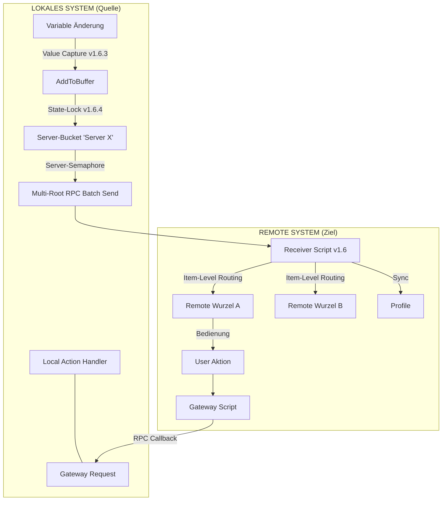
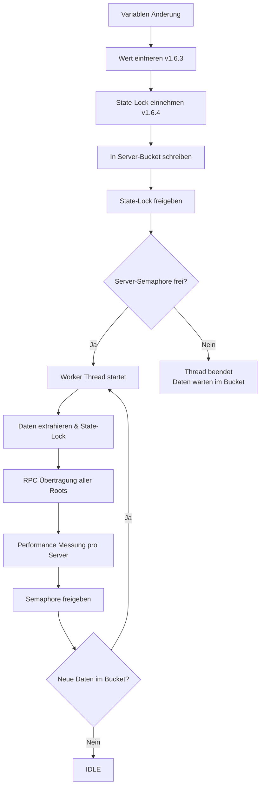
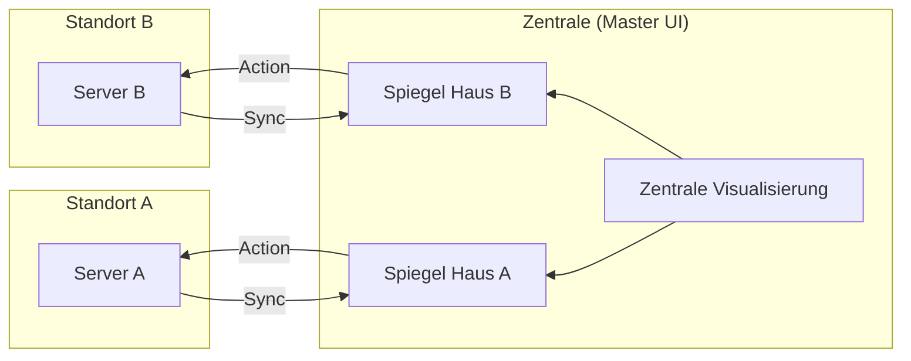
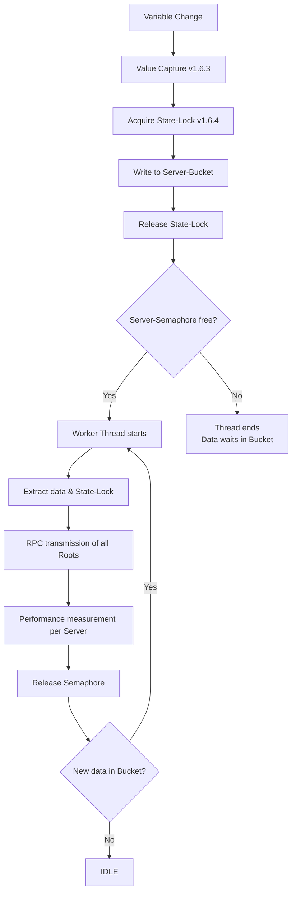

# Hochperformante, bidirektionale Synchronisierung von Variablen-Strukturen zwischen entfernten IP-Symcon Systemen

## 1. Einführung & Problemstellung

In komplexen IP-Symcon-Umgebungen mit mehreren Standorten (z. B. Haupthaus, Gartenhaus, Büro) stellt die Synchronisation von Daten eine Herausforderung dar. Klassische Lösungen leiden oft unter:

- **Hoher Netzwerklast:** Viele Einzel-RPC-Aufrufe verzögern das System.
- **Wartungsaufwand:** Manuelles Anlegen von Variablen und Profilen auf Zielsystemen ist fehleranfällig.
- **Fehlende Interaktion:** Reine Visualisierung von Werten reicht meist nicht aus; eine Steuerung zurück zum Quellsystem ist oft komplex zu realisieren.

## 2. Die Lösung: Das RemoteSync-Prinzip (v1.6.4)

RemoteSync fungiert als intelligente Brücke, die nicht nur Daten überträgt, sondern die Logik zur Steuerung direkt mitliefert ("Injected Gateway"). **Version 1.6.4** führt das hocheffiziente **Server-Bucket-Modell** sowie Mechanismen zur absoluten Datenintegrität ein.

- **Autonomes Worker-Modell:** Das Modul nutzt ein event-getriebenes System mit Semaphoren auf Server-Ebene. Seit v1.6.1 arbeitet das Modul vollständig asynchron und timer-frei.
- **Atomares State-Locking (v1.6.4):** Zur Vermeidung von Race Conditions bei hohem Datenaufkommen nutzt das Modul einen internen State-Lock (`RS_StateLock`), der den Zugriff auf den Puffer threadsicher regelt.
- **Echtzeit-Event-Erfassung (v1.6.3):** Werte werden im Moment des Events direkt eingefroren ("Captured"), um sicherzustellen, dass jeder Zwischenschritt erfasst wird, bevor die Variable sich erneut ändert.
- **Full-History / Anti-Conflation (v1.6.2):** Optional kann pro Variable gewählt werden, ob Zwischenwerte verworfen werden ("Last-Value-Wins") oder eine lückenlose Historie aller Änderungen übertragen wird.
- **Dynamisches Übertragungsverhalten (Server-Bucket):**
  - **Einzel-Updates (IDLE-Zustand):** Ändert sich eine einzelne Variable, wird der Worker-Thread sofort gestartet. Die Änderung wird ohne künstliche Verzögerung übertragen.
  - **Server-Bündelung / Bursts (BUSY-Zustand):** Während eine Übertragung läuft, wirkt das Modul wie ein „selbstregulierendes Ventil“. Alle Änderungen für denselben Ziel-Server (unabhängig vom Mapping) sammeln sich im **Server-Bucket** und werden nach Abschluss der aktuellen Übertragung sofort als ein hocheffizientes Multi-Root-Batch-Paket nachgereicht.
- **Profil-Replikation:** Lokale Variablenprofile werden automatisch auf dem Zielsystem erstellt.
- **Unified Dashboard:** Ermöglicht die Zusammenführung vieler Quell-Systeme in einer einzigen Benutzeroberfläche (Symcon UI / IPSView).

## 3. Datenfluss & Architektur

### A. Synchronisations-Ablauf (Logik v1.6.4)

### B. Worker-Modell & Parallelität

RemoteSync nutzt System-Semaphoren zur Steuerung der Parallelität auf Basis des **Ziel-Servers (Folder Name)** sowie einen internen State-Lock zum Schutz der Puffer-Integrität. Dies garantiert, dass pro Remote-System immer genau eine Verbindung aktiv ist, was den Netzwerk-Overhead (HTTPS-Handshakes) massiv reduziert.

### C. Das "Unified Dashboard" (N:1 Föderation)

## 4. Dateneffizienz & Gruppierungslogik

### A. Das "Last-Value-Wins" Prinzip

Um die Netzwerklast zu minimieren, bereinigt RemoteSync den Puffer pro Server automatisch. Befinden sich mehrere Aktualisierungen derselben Variable gleichzeitig im Bucket, wird im Standardmodus nur der **zuletzt erfasste Wert** übertragen. Hierdurch können bei extrem schnellen Wertänderungen einzelne Zwischenschritte in der Zeitreihe übersprungen werden. **Seit v1.6.2** kann über die Option **"Full History"** eine lückenlose Übertragung aller Zwischenschritte erzwungen werden.

### B. Gruppierung nach Servern (v1.6.0 Effizienz)

Die Zusammenfassung erfolgt nach den definierten **Targets (Folder)**. Alle Mappings, die zum selben Server führen, teilen sich einen Worker-Thread und eine Semaphore. Ein langsames Netzwerk zu _Server A_ beeinträchtigt somit niemals die Geschwindigkeit zu _Server B_.

### C. Garantierte Chronologie

Das System garantiert eine strikte Sequenzierung innerhalb eines Datenstroms zum Server. Alle Werte werden in der exakten zeitlichen Reihenfolge ihrer Erfassung übertragen. Das Semaphoren-Locking in Kombination mit dem **State-Locking (v1.6.4)** verhindert technisch, dass Pakete sich gegenseitig überholen ("Out-of-Order") oder bereits gesendete Daten den Puffer erneut füllen.

## 5. Performance Monitoring

Über das Panel "Performance Monitoring" können Echtzeit-Sensoren pro Ziel-Server installiert werden:

- **RTT (ms):** Gesamtdauer der Netzwerk-Transaktion zum Server.
- **Batch Size (Items):** Anzahl der gebündelten Änderungen über alle Mappings im letzten Paket.
- **Payload Size (KB):** Tatsächliche Größe des JSON-Pakets.
- **Errors (Count):** Zähler für fehlgeschlagene Übertragungen.
- **Skipped (Count):** Anzahl der durch "Last-Value-Wins" verworfenen Zwischenwerte.
- **Lag (s):** Zeitverzögerung zwischen der ersten Änderung im Bucket und dem Versand.
- **Queue (Count):** Aktuelle Anzahl der im Bucket wartenden Änderungen.

## 6. Parametrisierung

- **Schritt 1:** Definition der Remote-Ziele (Folder Name, SEC-Key, Script Root ID, SEC-ID).
- **Schritt 2:** Zuordnung lokaler Quell-Objekte (Roots) zu den Foldern und Remote-IDs.
- **Schritt 3:** Auswahl der Variablen (Sync, Full History, R-Action, Remote Löschen).

## 7. Vergleich: RemoteSync (RS) vs. Natives Sync Remote

| Merkmal          | IP-Symcon "Sync Remote" (Nativ)                | RemoteSync (v1.6.4)                         |
| :--------------- | :--------------------------------------------- | :------------------------------------------ |
| **Philosophie**  | **Full-Inclusion:** Import des gesamten Baums. | **Selective-Push:** Export gewählter Daten. |
| **Richtung**     | Server zieht (Pull).                           | Quelle drückt (Push).                       |
| **Ressourcen**   | Hohe Last durch Voll-Synchronisation.          | Maximum durch Server-Bucket Batching.       |
| **Verbindungen** | Variabel                                       | **Strikt 1 pro Ziel-Server**                |
| **Historie**     | Nur aktueller Zustand                          | **Wählbare Full-History**                   |

**Vorteile von RemoteSync:**

1. **Zentralisierung:** Daten vieler Standorte auf einem Visualisierungs-Server.
2. **Interaktivität:** Entfernte Variablen verhalten sich wie lokale Geräte (inkl. Rücksteuerung).
3. **Datenschutz:** Nur explizit gewählte Daten verlassen das Quellsystem.
4. **Effizienz:** Optimiert für schmalbandige Verbindungen (LTE) durch minimale TCP-Handshakes.

## 8. Sicherheit & Stabilität

- **SEC-Modul:** Keine Speicherung von Passwörtern im Modul.
- **Zustandslosigkeit:** Keine persistenten Flags; sauberer Start nach jedem Reboot.
- **Atomarität (v1.6.4):** Durch den `RS_StateLock` ist die Integrität der gepufferten Daten auch bei massiven Bursts und parallelen Zugriffen jederzeit garantiert.
- **Verschlüsselung:** TLS-verschlüsseltes HTTPS.
- **Referenz-Schutz:** Variablen werden auf dem Zielsystem über das Feld `ObjectInfo` (`RS_REF:Key:ID`) eindeutig identifiziert.

---

---

# High-Performance, Bidirectional Synchronization of Variable Structures Between Remote IP-Symcon Systems

## 1. Introduction & Problem Statement

In complex IP-Symcon environments with multiple locations (e.g., main house, garden house, office), data synchronization is a challenge. Classic solutions often suffer from:

- **High Network Load:** Numerous individual RPC calls slow down the system.
- **Maintenance Effort:** Manually creating variables and profiles on target systems is error-prone.
- **Lack of Interaction:** Pure visualization is often insufficient; controlling the source system from the remote site is complex to implement.

## 2. The Solution: The RemoteSync Principle (v1.6.4)

RemoteSync acts as an intelligent bridge that not only transfers data but also injects the control logic directly ("Injected Gateway"). **Version 1.6.4** introduces the high-efficiency **Server-Bucket Model** and mechanisms for absolute data integrity.

- **Autonomous Worker Model:** The module uses an event-driven system with semaphores at the server level. Since v1.6.1, the module is completely asynchronous and timer-free.
- **Atomic State-Locking (v1.6.4):** To prevent race conditions during high data volume, the module uses an internal state lock (`RS_StateLock`) to regulate buffer access in a thread-safe manner.
- **Real-Time Event Capture (v1.6.3):** Values are captured at the exact moment of the event to ensure every intermediate step is recorded before the variable changes again.
- **Full-History / Anti-Conflation (v1.6.2):** Mode selectable per variable to either discard intermediate values ("Last-Value-Wins") or transmit a complete history of all changes.
- **Dynamic Transmission Behavior (Server-Bucket):**
  - **Single Updates (IDLE state):** If a single variable changes, the worker thread starts immediately. The change is transferred without artificial delay.
  - **Server Bundling / Bursts (BUSY state):** During an active transmission, the module acts as a "self-regulating valve." All changes for the same target server (regardless of mapping) accumulate in the **Server-Bucket** and are sent as a high-efficiency multi-root batch package immediately after the current transfer finishes.
- **Profile Replication:** Local variable profiles are automatically created on the target system.
- **Unified Dashboard:** Enables the merging of many source systems into a single user interface (Symcon UI / IPSView).

## 3. Data Flow & Architecture

### A. Synchronization Flow (Logic v1.6.4)

(See Mermaid diagram in German section 3.A, showing Value Capture and State-Lock logic)

### B. Worker Model & Parallelism

RemoteSync uses system semaphores to control concurrency based on the **Target Server (Folder Name)** and an internal state lock for data integrity. This guarantees that exactly one connection is active per remote system, massively reducing network overhead (HTTPS handshakes).

### C. Unified Dashboard (N:1 Federation)

(See Mermaid diagram in German section 3.C)

## 4. Data Efficiency & Grouping Logic

### A. The "Last-Value-Wins" Principle

To minimize network load, RemoteSync automatically cleans the buffer per server. In standard mode, if multiple updates for the same variable are in the bucket simultaneously, only the **most recent value** is transmitted. Consequently, intermediate steps in a time series may be skipped during extremely rapid changes. **Since v1.6.2**, the **"Full History"** option can be used to force a gapless transmission of all intermediate steps.

### B. Grouping by Servers (v1.6.0 Efficiency)

Data bundling is strictly separated by the defined **Targets (Folders)**. All mappings leading to the same server share one worker thread and one semaphore. A slow network to _Server A_ will never affect the synchronization speed to _Server B_.

### C. Guaranteed Chronology

The system guarantees strict sequencing within a data stream to the server. All values are transmitted in the exact chronological order in which they were captured. Semaphore locking combined with **State-Locking (v1.6.4)** technically prevents packages from overtaking each other ("Out-of-Order") or old buffer states from refilling the buffer.

## 5. Performance Monitoring

Real-time sensors can be installed per target server via the "Performance Monitoring" panel:

- **RTT (ms):** Total duration of the network transaction to the server.
- **Batch Size (Items):** Number of changes bundled across all mappings in the last package.
- **Payload Size (KB):** Actual size of the transmitted JSON string.
- **Errors (Count):** Counter for failed transmissions.
- **Skipped (Count):** Number of intermediate values discarded by "Last-Value-Wins".
- **Lag (s):** Delay between the first change in the bucket and actual transmission.
- **Queue (Count):** Current number of changes waiting in the bucket.

## 6. Parameterization

- **Step 1:** Define remote targets (Folder Name, SEC-Key, Script Root ID, SEC-ID).
- **Step 2:** Map local source objects (Roots) to folders and remote IDs.
- **Step 3:** Individual selection (Sync, Full History, R-Action, Remote Delete).

## 7. Comparison: RemoteSync (RS) vs. Native Sync Remote

| Feature         | IP-Symcon "Sync Remote" (Native)               | RemoteSync (v1.6.4)                          |
| :-------------- | :--------------------------------------------- | :------------------------------------------- |
| **Philosophy**  | **Full-Inclusion:** Import of the entire tree. | **Selective-Push:** Export of selected data. |
| **Direction**   | Server pulls.                                  | Source pushes.                               |
| **Resources**   | High load due to full sync.                    | Maximum via Server-Bucket batching.          |
| **Connections** | Variable                                       | **Strictly 1 per target server**             |
| **History**     | Current state only                             | **Selectable Full-History**                  |

**Advantages of RemoteSync:**

1. **Centralization:** Data from many sites on one visualization server.
2. **Interactivity:** Remote variables behave like local devices (incl. `RequestAction`).
3. **Data Privacy:** Only explicitly chosen data leaves the source system.
4. **Efficiency:** Optimized for narrow-band connections (LTE) by minimizing TCP handshakes.

## 8. Security & Stability

- **SEC Module:** No passwords stored within the module.
- **Statelessness:** No persistent flags; clean start after every reboot.
- **Atomicity (v1.6.4):** Through `RS_StateLock`, the integrity of buffered data is guaranteed at all times, even during massive bursts and parallel access.
- **Encryption:** TLS-encrypted HTTPS.
- **Reference Protection:** Variables are uniquely identified on the target system via the `ObjectInfo` field (`RS_REF:Key:ID`).

---

**Version:** 1.6.4 (Atomic State-Lock Update)
**Status:** Gold Master
