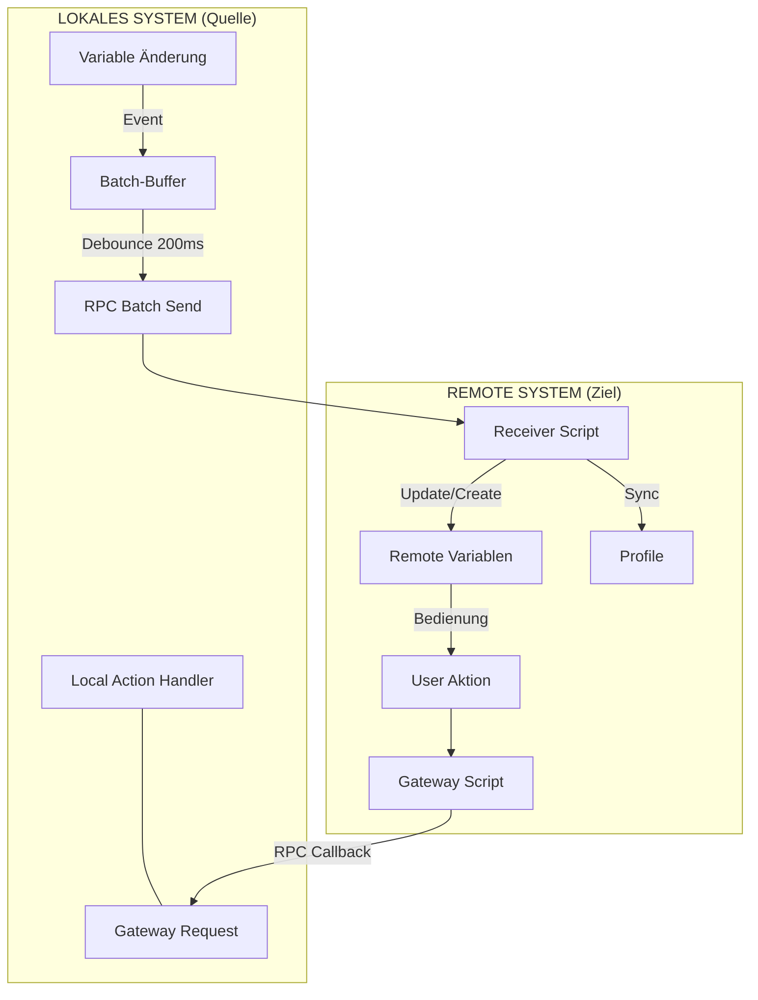
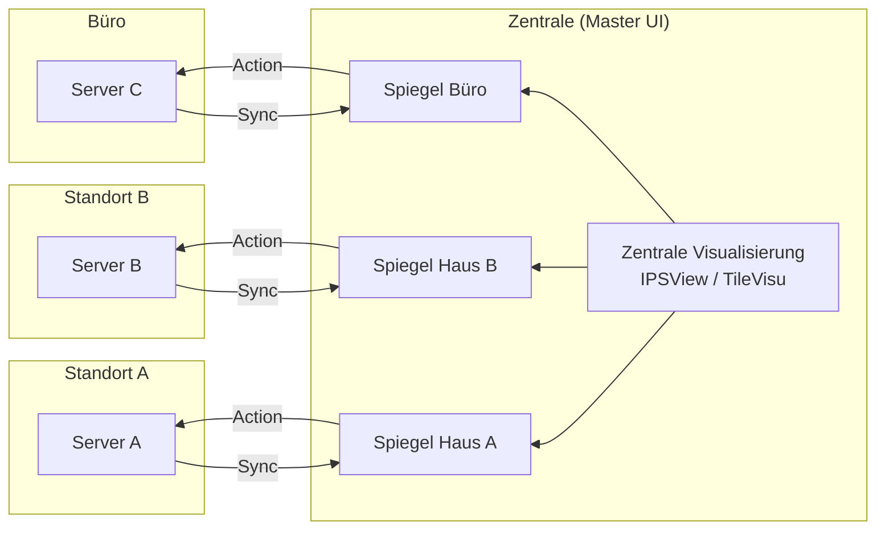

# Dokumentation: RemoteSync (RS) - Hochperformante System-Föderation

## 1. Einführung & Problemstellung
In komplexen IP-Symcon-Umgebungen mit mehreren Standorten (z. B. Haupthaus, Gartenhaus, Büro) stellt die Synchronisation von Daten eine Herausforderung dar. Klassische Lösungen leiden oft unter:

*   **Hoher Netzwerklast:** Viele Einzel-RPC-Aufrufe verzögern das System.
*   **Wartungsaufwand:** Manuelles Anlegen von Variablen und Profilen auf Zielsystemen ist fehleranfällig.
*   **Fehlende Interaktion:** Reine Visualisierung von Werten reicht meist nicht aus; eine Steuerung zurück zum Quellsystem ist oft komplex zu realisieren.

## 2. Die Lösung: Das RemoteSync-Prinzip
RemoteSync fungiert als **intelligente Brücke**, die nicht nur Daten überträgt, sondern die Logik zur Steuerung direkt mitliefert ("Injected Gateway").

*   **Batch-Processing:** Änderungen werden gesammelt und nach einer Ruhepause (200ms) in einem einzigen verschlüsselten Paket übertragen.
*   **Profil-Replikation:** Lokale Variablenprofile werden automatisch auf dem Zielsystem erstellt.
*   **Unified Dashboard:** Ermöglicht die Zusammenführung vieler Quell-Systeme in einer einzigen Benutzeroberfläche (Symcon UI / IPSView), ohne zwischen Servern wechseln zu müssen.

## 3. Datenfluss & Architektur

### A. Synchronisations-Ablauf (Lokal -> Remote)
Geänderte Variablen werden lokal gepuffert und als Batch an das injizierte Empfänger-Skript gesendet.

### B. Das "Unified Dashboard" (N:1 Föderation)
Dies ist der Kernvorteil gegenüber Standardlösungen: Mehrere Standorte werden in einer zentralen Steuereinheit zusammengefasst.

## 4. Parametrisierung

### Schritt 1: Define Remote Targets (Infrastruktur)
Verwaltung der Server-Verbindungen.
*   **Remote Server Key:** Zugangsdaten aus dem Secrets Manager.
*   **Remote Script Root ID:** Kategorie auf dem Zielsystem für die technischen Hilfsskripte.

### Schritt 2: Map Local Roots to Folders (Logik)
Verknüpfung der lokalen Datenbereiche mit den Ziel-Servern.
*   **Local Object (Source):** Die lokale Quell-Kategorie (z. B. "Erdgeschoss").
*   **Remote Root ID:** Die Ziel-Kategorie auf dem entfernten Server.

### Schritt 3: Individual Selection (Auswahl)
Feingranulare Auswahl der Variablen innerhalb der definierten Mappings. Die Gruppierung erfolgt hier nach den lokalen Quell-Objekten aus Schritt 2.
*   **Sync:** Variable wird aktiv gespiegelt.
*   **R-Action:** Aktiviert die Rücksteuerung (Variable wird auf dem Zielsystem schaltbar).
*   **Del Rem.:** Markiert das Objekt zur Löschung auf dem Remote-System.

## 5. Vergleich: RemoteSync vs. Natives IP-Symcon Mirroring

| Feature | Natives IP-Symcon Mirroring | RemoteSync Modul |
| :--- | :--- | :--- |
| **Primärziel** | **Ausfallsicherheit (HA):** Ersatz für defekte Hardware. | **Daten-Föderation:** Vernetzung unabhängiger Systeme. |
| **Umfang** | 1:1 Kopie des gesamten Servers. | Gezielte Auswahl einzelner Variablen/Kategorien. |
| **Richtung** | Unidirektional (Server -> Mirror). | Bidirektional (Werte hin, Befehle zurück). |
| **UI-Szenario** | Ein System ersetzt ein anderes. | **Unified UI:** Viele Systeme in einer Oberfläche. |
| **Kosten** | Kostenpflichtige Extension. | Kostenloses PHP-Modul. |

## 6. Sicherheitshinweise
*   **Secrets Manager:** Das Modul speichert keine Passwörter. Alle Credentials werden über das SEC-Modul (Password Vault) bezogen.
*   **Verschlüsselung:** Die Kommunikation erfolgt ausschließlich über TLS-verschlüsseltes HTTPS.
*   **Referenz-Schutz:** Variablen werden auf dem Zielsystem über das Feld `ObjectInfo` (`RS_REF:Key:ID`) eindeutig identifiziert, was die Synchronisation immun gegen Umbenennungen macht.
