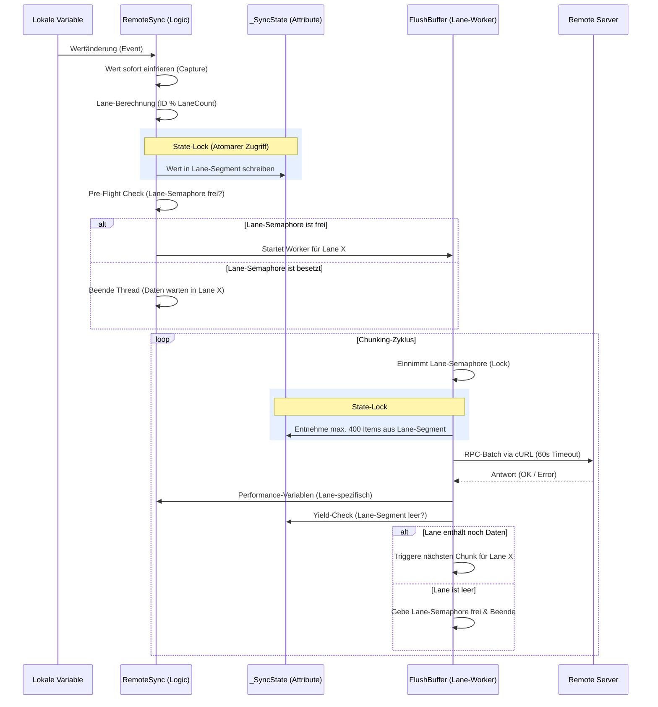
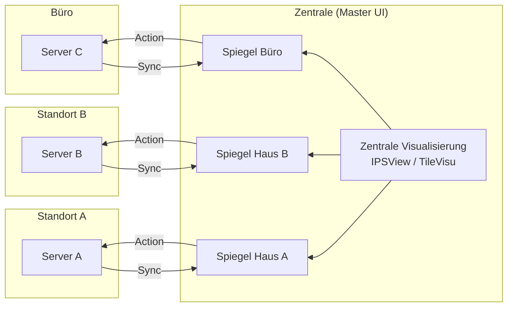

# Dokumentation: RemoteSync (RS) - Hochperformante System-Föderation (v1.9.8)

## 1. Einführung & Problemstellung
In komplexen IP-Symcon-Umgebungen mit mehreren Standorten stellt die Synchronisation von Daten eine Herausforderung dar. Klassische Lösungen leiden oft unter hoher Netzwerklast, manuellem Wartungsaufwand und fehlender Rücksteuerung. 

**RemoteSync v1.9.8** löst diese Probleme durch eine hochperformante, lane-basierte Architektur, die Daten nicht nur spiegelt, sondern eine bidirektionale Interaktion in Echtzeit ermöglicht.

## 2. Die Lösung: Das RemoteSync-Prinzip
RemoteSync fungiert als **intelligente Brücke**, die Daten selektiv pusht und die Logik zur Steuerung direkt mitliefert ("Injected Gateway").

*   **Lane-Multi-Threading:** Daten werden auf mehrere parallele Übertragungswege (Lanes) verteilt, um Blockaden durch einzelne hochfrequente Variablen zu verhindern.
*   **Batch-Processing (v1.9.8):** Änderungen werden gesammelt und in hocheffizienten Paketen von bis zu **400 Items** pro Sendevorgang übertragen.
*   **Profil-Replikation:** Lokale Variablenprofile werden automatisch auf dem Zielsystem erstellt.
*   **Unified Dashboard:** Ermöglicht die Zusammenführung vieler Quell-Systeme in einer einzigen Benutzeroberfläche (Symcon UI / IPSView), ohne zwischen Servern wechseln zu müssen.

## 3. Datenfluss & Architektur

### A. Synchronisations-Ablauf (Sequenzdiagramm v1.9.8)
Dieses Diagramm zeigt, wie eine Wertänderung durch die Lane-Berechnung und das State-Locking bis zum Remote-Server gelangt.

### B. Das "Unified Dashboard" (N:1 Föderation)
Mehrere Standorte werden in einer zentralen Steuereinheit (Master) zusammengefasst.

## 4. Parametrisierung

### Schritt 1: Define Remote Targets (Infrastruktur)
*   **Remote Server Key:** Zugangsdaten aus dem Secrets Manager (SEC-Modul).
*   **Remote Script Root ID:** Kategorie auf dem Zielsystem für die technischen Hilfsskripte.
*   **Lane Count:** Anzahl der parallelen Übertragungskanäle (Standard: 3).

### Schritt 2: Map Local Roots to Folders (Logik)
*   **Local Object (Source):** Die lokale Quell-Kategorie (z. B. "Erdgeschoss").
*   **Remote Root ID:** Die Ziel-Kategorie auf dem entfernten Server.

### Schritt 3: Individual Selection (Auswahl)
*   **Sync:** Variable wird aktiv gespiegelt.
*   **R-Action:** Aktiviert die Rücksteuerung (Variable wird auf dem Zielsystem schaltbar).
*   **Del Rem.:** Markiert das Objekt zur Löschung auf dem Remote-System.

## 5. Aktuelle System-Parameter (v1.9.8)

| Parameter | Aktueller Wert | Funktion |
| :--- | :--- | :--- |
| **Chunk-Limit** | **400 Items** | Maximale Anzahl Variablen pro Netzwerk-Paket. |
| **Parallelität** | **1 - 3 Lanes** | Anzahl paralleler Verbindungen pro Server. |
| **RPC-Timeout** | **60 Sekunden** | Maximale Zeit für cURL-Übertragung. |
| **Connect-Timeout**| 30 Sekunden | Maximale Zeit für den Verbindungsaufbau (cURL). |
| **State-Lock** | 1000 ms | Wartezeit für atomaren Zugriff auf den Puffer. |
| **Ident-System** | `RS_Gateway` / `RS_Receiver` | Ident-basierte Skriptsuche auf dem Remote-System. |

## 6. Vergleich: RemoteSync vs. Natives IP-Symcon Sync Remote

### Selective-Push vs. Full-Inclusion
Während das native IP-Symcon Modul „Sync Remote“ (ab v7.1) darauf ausgelegt ist, einen entfernten Client vollständig zu integrieren (Full-Inclusion), verfolgt RemoteSync den Ansatz des **Selective-Push**.

| Merkmal | IP-Symcon "Sync Remote" | RemoteSync (v1.9.8) |
| :--- | :--- | :--- |
| **Philosophie** | **Full-Inclusion:** Server "holt" den gesamten Baum. | **Selective-Push:** Quelle "sendet" gewählte Daten. |
| **Richtung** | Server zieht vom Client (Pull). | Quelle drückt zum Ziel (Push). |
| **Ressourcen** | Hohe Last durch gesamten Baum. | Effizient durch 400er Batches & Lanes. |
| **Anwendung** | Master-Slave Integration. | **Unified Dashboard:** N:1 Kopplung. |

### Der entscheidende Vorteil: Das Unified Dashboard (N:1)
1.  **Zentralisierung:** Daten von vielen Standorten auf einem Visualisierungs-Server.
2.  **Volle Interaktivität:** Entfernte Variablen verhalten sich wie lokale Geräte (inkl. Rücksteuerung).
3.  **Datenschutz:** Nur relevante Daten werden übertragen; die Datenhoheit bleibt bei der Quelle.
4.  **Effizienz:** Stabil auch bei schmalbandigen Verbindungen dank cURL und Lane-Steuerung.

## 7. Sicherheitshinweise
*   **Secrets Manager:** Keine Speicherung von Passwörtern im Modul; Nutzung des SEC-Moduls.
*   **Verschlüsselung:** Ausschließlich TLS-verschlüsseltes HTTPS via cURL.
*   **Referenz-Schutz:** Identifikation auf dem Zielsystem via `ObjectInfo` (`RS_REF:Key:ID`), immun gegen Umbenennungen.
*   **Atomarität:** Alle Pufferoperationen sind durch `IPS_Semaphore` (State-Lock) gegen Race-Conditions geschützt.
