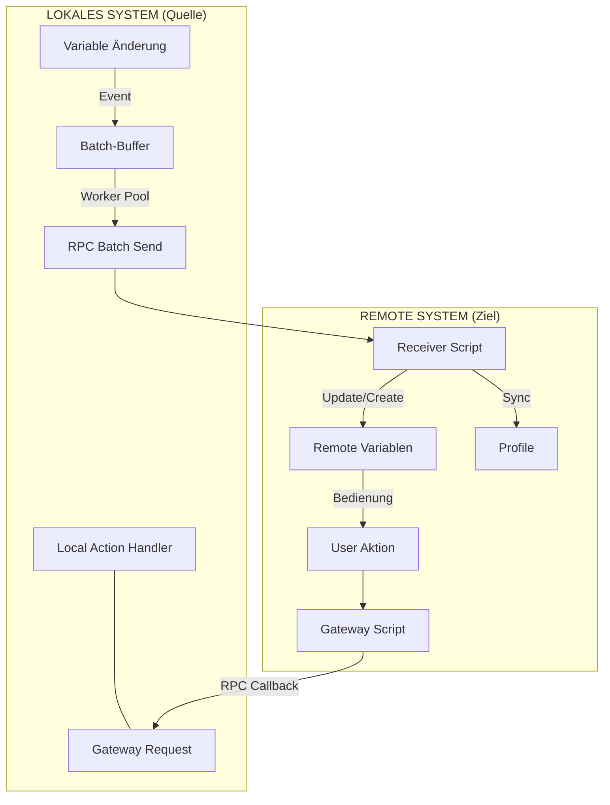
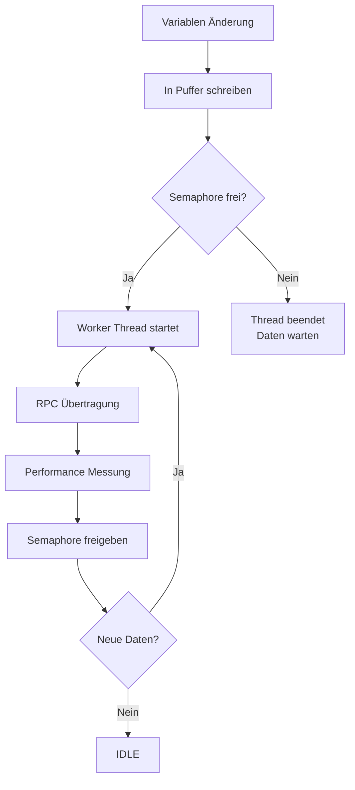
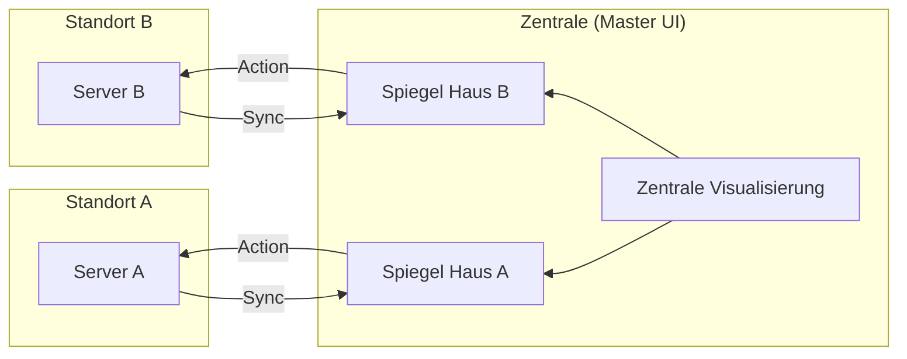

# Dokumentation: RemoteSync (RS) - Hochperformante System-Föderation

## 1. Einführung & Problemstellung
In komplexen IP-Symcon-Umgebungen mit mehreren Standorten (z. B. Haupthaus, Gartenhaus, Büro) stellt die Synchronisation von Daten eine Herausforderung dar. Klassische Lösungen leiden oft unter:
*   **Hoher Netzwerklast:** Viele Einzel-RPC-Aufrufe verzögern das System.
*   **Wartungsaufwand:** Manuelles Anlegen von Variablen und Profilen auf Zielsystemen ist fehleranfällig.
*   **Fehlende Interaktion:** Reine Visualisierung von Werten reicht meist nicht aus; eine Steuerung zurück zum Quellsystem ist oft komplex zu realisieren.

## 2. Die Lösung: Das RemoteSync-Prinzip (v1.5.1)
RemoteSync fungiert als intelligente Brücke, die nicht nur Daten überträgt, sondern die Logik zur Steuerung direkt mitliefert ("Injected Gateway").

*   **Autonomes Worker-Modell:** Ab v1.5.1 nutzt das Modul ein event-getriebenes System mit Semaphoren.
*   **Dynamisches Übertragungsverhalten:**
    *   **Einzel-Updates (IDLE-Zustand):** Ändert sich eine einzelne Variable, wird der Worker-Thread sofort gestartet. Die Änderung wird ohne künstliche Verzögerung (Latenz im Millisekundenbereich) übertragen.
    *   **Mehrfach-Updates / Bursts (BUSY-Zustand):** Während eine Übertragung läuft, wirkt das Modul wie ein „selbstregulierendes Ventil“. Weitere Änderungen sammeln sich im Puffer und werden nach Abschluss der aktuellen Übertragung sofort als hocheffizientes Batch-Paket nachgereicht.
*   **Profil-Replikation:** Lokale Variablenprofile werden automatisch auf dem Zielsystem erstellt.
*   **Unified Dashboard:** Ermöglicht die Zusammenführung vieler Quell-Systeme in einer einzigen Benutzeroberfläche (Symcon UI / IPSView).

## 3. Datenfluss & Architektur

### A. Synchronisations-Ablauf (Logik)

### B. Worker-Modell & Parallelität
RemoteSync nutzt System-Semaphoren zur Steuerung der Parallelität. Dies garantiert, dass pro Variablen-Set (Mapping) immer genau eine Verbindung aktiv ist.

### C. Das "Unified Dashboard" (N:1 Föderation)

## 4. Dateneffizienz & Gruppierungslogik

### A. Das "Last-Value-Wins" Prinzip
Um die Netzwerklast zu minimieren, bereinigt RemoteSync den Puffer automatisch. Befinden sich mehrere Aktualisierungen derselben Variable gleichzeitig im Puffer, wird nur der **zuletzt erfasste Wert** übertragen. Hierdurch können bei extrem schnellen Wertänderungen einzelne Zwischenschritte in der Zeitreihe übersprungen werden.

### B. Gruppierung nach Sets (Parallelität)
Die Zusammenfassung erfolgt nach den definierten **Mappings (Sets)**. Jedes Set verfügt über einen eigenen Worker-Thread und eine eigene Semaphore. Ein langsames Netzwerk zu *Server A* beeinträchtigt somit niemals die Geschwindigkeit zu *Server B*.

### C. Garantierte Chronologie
Das System garantiert eine strikte Sequenzierung innerhalb eines Sets. Alle Werte werden in der exakten zeitlichen Reihenfolge ihrer Erfassung übertragen. Das Semaphoren-Locking verhindert technisch, dass Pakete sich gegenseitig überholen ("Out-of-Order").

## 5. Performance Monitoring
Über das Panel "Performance Monitoring" können Echtzeit-Sensoren installiert werden:
*   **RTT (ms):** Gesamtdauer der Netzwerk-Transaktion.
*   **Batch Size (Items):** Anzahl der gebündelten Änderungen pro Paket.
*   **Payload Size (KB):** Tatsächliche Größe des JSON-Pakets.
*   **Errors (Count):** Zähler für fehlgeschlagene Übertragungen.

## 6. Parametrisierung
*   **Schritt 1:** Definition der Remote-Ziele (Folder Name, SEC-Key, Script Root ID, SEC-ID).
*   **Schritt 2:** Zuordnung lokaler Quell-Objekte (Roots) zu den Foldern und Remote-IDs.
*   **Schritt 3:** Auswahl der Variablen (Sync, R-Aktion, Remote Löschen).

## 7. Vergleich: RemoteSync (RS) vs. Natives Sync Remote
| Merkmal | IP-Symcon "Sync Remote" (Nativ) | RemoteSync (Dieses Modul) |
| :--- | :--- | :--- |
| **Philosophie** | **Full-Inclusion:** Import des gesamten Baums. | **Selective-Push:** Export gewählter Daten. |
| **Richtung** | Server zieht (Pull). | Quelle drückt (Push). |
| **Ressourcen** | Hohe Last durch Voll-Synchronisation. | Extrem effizient durch Batch-Worker. |

**Vorteile von RemoteSync:**
1. **Zentralisierung:** Daten vieler Standorte auf einem Visualisierungs-Server.
2. **Interaktivität:** Entfernte Variablen verhalten sich wie lokale Geräte (inkl. Rücksteuerung).
3. **Datenschutz:** Nur explizit gewählte Daten verlassen das Quellsystem.
4. **Effizienz:** Optimiert für schmalbandige Verbindungen (LTE).

## 8. Sicherheit & Stabilität
*   **SEC-Modul:** Keine Speicherung von Passwörtern im Modul.
*   **Zustandslosigkeit:** Keine persistenten Flags; sauberer Start nach jedem Reboot.
*   **Verschlüsselung:** TLS-verschlüsseltes HTTPS.

---
---

# Documentation: RemoteSync (RS) - High-Performance System Federation

## 1. Introduction & Problem Statement
In complex IP-Symcon environments with multiple locations (e.g., main house, garden house, office), data synchronization is a challenge. Classic solutions often suffer from:
*   **High Network Load:** Numerous individual RPC calls slow down the system.
*   **Maintenance Effort:** Manually creating variables and profiles on target systems is error-prone.
*   **Lack of Interaction:** Pure visualization is often insufficient; controlling the source system from the remote site is complex to implement.

## 2. The Solution: The RemoteSync Principle (v1.5.1)
RemoteSync acts as an intelligent bridge that not only transfers data but also injects the control logic directly ("Injected Gateway").

*   **Autonomous Worker Model:** Since v1.5.1, the module uses an event-driven system with semaphores.
*   **Dynamic Transmission Behavior:**
    *   **Single Updates (IDLE state):** If a single variable changes, the worker thread starts immediately. The change is transferred without artificial delay (latency in milliseconds).
    *   **Multiple Updates / Bursts (BUSY state):** During an active transmission, the module acts as a "self-regulating valve." Further changes accumulate in the buffer and are sent as a high-efficiency batch package immediately after the current transfer finishes.
*   **Profile Replication:** Local variable profiles are automatically created on the target system.
*   **Unified Dashboard:** Enables the merging of many source systems into a single user interface (Symcon UI / IPSView).

## 3. Data Flow & Architecture

### A. Synchronization Flow (Logic)
(See Mermaid diagram in German section 3.A)

### B. Worker Model & Parallelism
RemoteSync uses system semaphores to control concurrency. This guarantees that exactly one connection is active per variable set (mapping).
(See Mermaid diagram in German section 3.B)

### C. Unified Dashboard (N:1 Federation)
(See Mermaid diagram in German section 3.C)

## 4. Data Efficiency & Grouping Logic

### A. The "Last-Value-Wins" Principle
To minimize network load, RemoteSync automatically cleans the buffer. If multiple updates for the same variable are in the buffer simultaneously, only the **most recent value** is transmitted. Consequently, intermediate steps in a time series may be skipped during extremely rapid changes.

### B. Grouping by Sets (Parallelism)
Data bundling is strictly separated by the defined **Mappings (Sets)**. Each set has its own worker thread and semaphore. A slow network to *Server A* will never affect the synchronization speed to *Server B*.

### C. Guaranteed Chronology
The system guarantees strict sequencing within a set. All values are transmitted in the exact chronological order in which they were captured. Semaphore locking technically prevents packages from overtaking each other ("Out-of-Order").

## 5. Performance Monitoring
Real-time sensors can be installed via the "Performance Monitoring" panel:
*   **RTT (ms):** Total duration of the network transaction.
*   **Batch Size (Items):** Number of changes bundled in the last package.
*   **Payload Size (KB):** Actual size of the transmitted JSON string.
*   **Errors (Count):** Counter for failed transmissions (e.g., timeouts).

## 6. Parameterization
*   **Step 1:** Define remote targets (Folder Name, SEC-Key, Script Root ID, SEC-ID).
*   **Step 2:** Map local source objects (Roots) to folders and remote IDs.
*   **Step 3:** Individual selection (Sync, R-Action, Remote Delete).

## 7. Comparison: RemoteSync (RS) vs. Native Sync Remote
| Feature | IP-Symcon "Sync Remote" (Native) | RemoteSync (This Module) |
| :--- | :--- | :--- |
| **Philosophy** | **Full-Inclusion:** Import of the entire tree. | **Selective-Push:** Export of selected data. |
| **Direction** | Server pulls. | Source pushes. |
| **Resources** | High load due to full sync. | Highly efficient via batch workers. |

**Advantages of RemoteSync:**
1. **Centralization:** Data from many sites on one visualization server.
2. **Interactivity:** Remote variables behave like local devices (incl. `RequestAction`).
3. **Data Privacy:** Only explicitly chosen data leaves the source system.
4. **Efficiency:** Optimized for narrow-band connections (LTE).

## 8. Security & Stability
*   **SEC Module:** No passwords stored within the module.
*   **Statelessness:** No persistent flags; clean start after every reboot.
*   **Encryption:** TLS-encrypted HTTPS.

---
**Version:** 1.5.1
