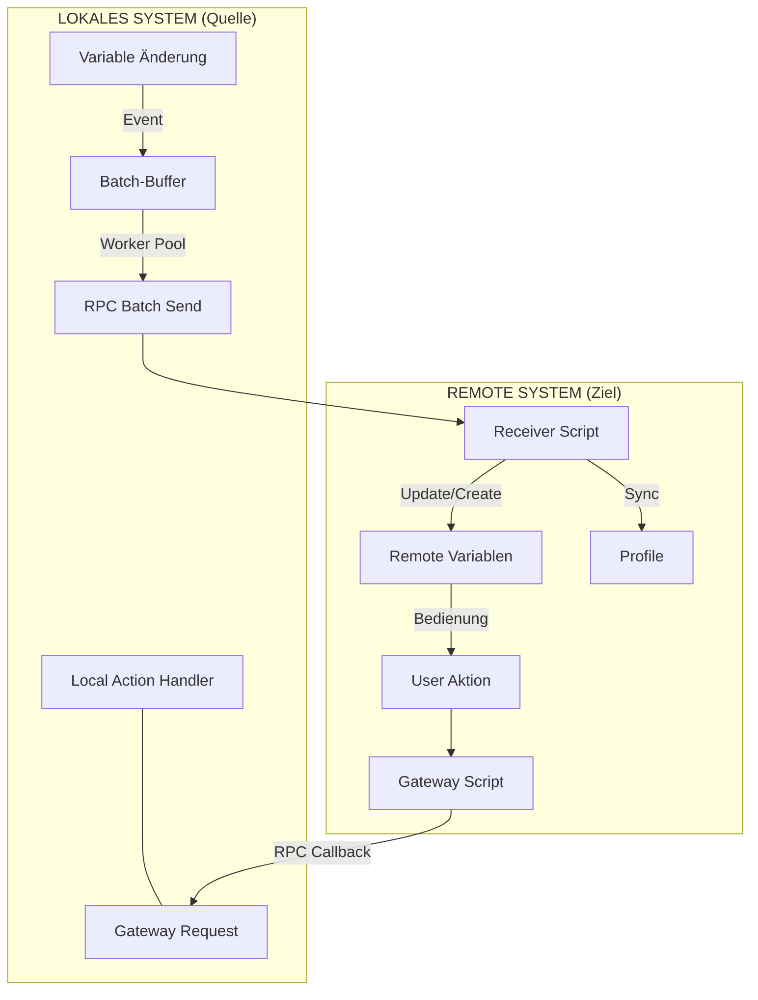
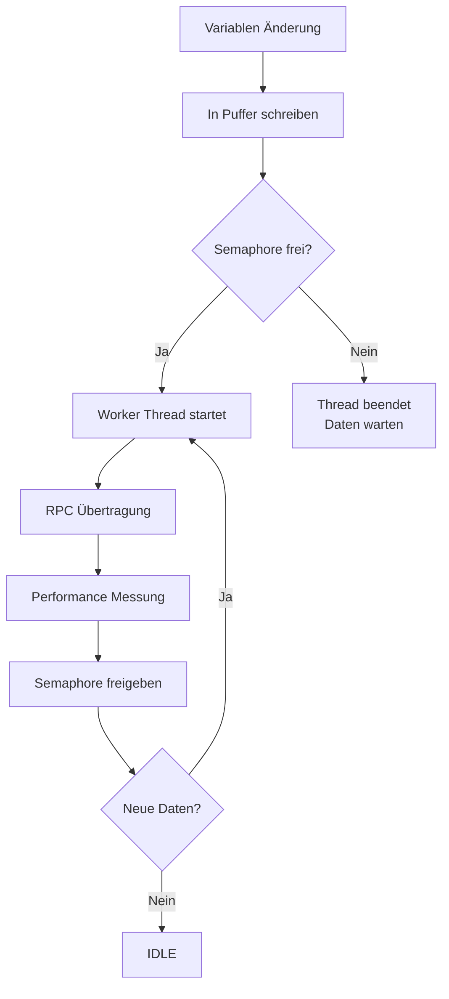
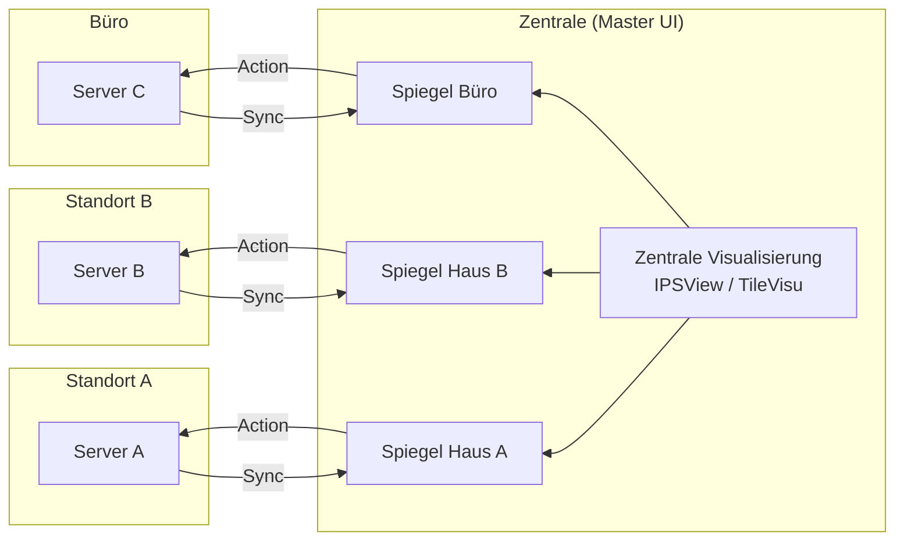

# Dokumentation: RemoteSync (RS) - Hochperformante System-Föderation

## 1. Einführung & Problemstellung

In komplexen IP-Symcon-Umgebungen mit mehreren Standorten (z. B. Haupthaus, Gartenhaus, Büro) stellt die Synchronisation von Daten eine Herausforderung dar. Klassische Lösungen leiden oft unter:

- **Hoher Netzwerklast:** Viele Einzel-RPC-Aufrufe verzögern das System.
- **Wartungsaufwand:** Manuelles Anlegen von Variablen und Profilen auf Zielsystemen ist fehleranfällig.
- **Fehlende Interaktion:** Reine Visualisierung von Werten reicht meist nicht aus; eine Steuerung zurück zum Quellsystem ist oft komplex zu realisieren.

## 2. Die Lösung: Das RemoteSync-Prinzip

RemoteSync fungiert als **intelligente Brücke**, die nicht nur Daten überträgt, sondern die Logik zur Steuerung direkt mitliefert ("Injected Gateway").

- **Batch-Processing:** Änderungen werden gesammelt und ab Version 1.5.1 durch ein autonomes Worker-Modell ohne künstliche Gedenksekunden übertragen.
- **Event-getriebener Start:** Übertragungen starten instantan bei Variablenänderung (Latenz im Millisekundenbereich).
- **Profil-Replikation:** Lokale Variablenprofile werden automatisch auf dem Zielsystem erstellt.
- **Unified Dashboard:** Ermöglicht die Zusammenführung vieler Quell-Systeme in einer einzigen Benutzeroberfläche (Symcon UI / IPSView), ohne zwischen Servern wechseln zu müssen.

## 3. Datenfluss & Architektur

### A. Synchronisations-Ablauf (Lokal -> Remote)

Geänderte Variablen werden lokal gepuffert und als Batch an das injizierte Empfänger-Skript gesendet.

### B. Das Autonome Worker-Modell (Neu in v1.5.1)

Seit Version 1.5.1 nutzt das Modul **System-Semaphoren** anstelle von Timern. Dies garantiert eine zustandslose, robuste Parallelität und verhindert Blockaden nach System-Neustarts.

### C. Das "Unified Dashboard" (N:1 Föderation)

Dies ist der Kernvorteil gegenüber Standardlösungen: Mehrere Standorte werden in einer zentralen Steuereinheit zusammengefasst.

## 4. Performance Monitoring (Neu in v1.5.1)

RemoteSync verfügt über ein integriertes Echtzeit-Monitoring zur Überwachung der Verbindungsqualität. Über das Panel "Performance Monitoring" können pro Set folgende Sensoren installiert werden:

| Metrik           | Einheit | Beschreibung                                                                  |
| :--------------- | :------ | :---------------------------------------------------------------------------- |
| **RTT**          | ms      | Round-Trip-Time: Gesamtdauer der Netzwerk-Transaktion (Request bis Response). |
| **Batch Size**   | Items   | Anzahl der im Paket gebündelten Variablen-Änderungen.                         |
| **Payload Size** | KB      | Tatsächliche Größe des übertragenen JSON-Pakets.                              |
| **Errors**       | Count   | Zähler für fehlgeschlagene Übertragungsversuche (z.B. Timeouts).              |

## 5. Parametrisierung

### Schritt 1: Define Remote Targets (Infrastruktur)

Verwaltung der Server-Verbindungen.

- **Folder Name:** Eindeutiger Alias für das Zielsystem (z.B. "Ferienhaus").
- **Remote Server Key:** Zugangsdaten aus dem Secrets Manager (SEC-Modul).
- **Remote Script Root ID:** Kategorie auf dem Zielsystem für die technischen Hilfsskripte.
- **Remote SEC ID:** Instanz-ID des SEC-Moduls auf dem Zielsystem.

### Schritt 2: Map Local Roots to Folders (Logik)

Verknüpfung der lokalen Datenbereiche mit den Ziel-Servern.

- **Local Object (Source):** Die lokale Quell-Kategorie (z. B. "Erdgeschoss").
- **Target Folder:** Auswahl des Ziel-Servers aus Schritt 1.
- **Remote Root ID:** Die Ziel-Kategorie auf dem entfernten Server.

### Schritt 3: Individual Selection (Auswahl)

Feingranulare Auswahl der Variablen innerhalb der definierten Mappings. Die Gruppierung erfolgt hier nach den lokalen Quell-Objekten aus Schritt 2.

- **Sync:** Variable wird aktiv gespiegelt.
- **R-Action:** Aktiviert die Rücksteuerung (Variable wird auf dem Zielsystem schaltbar).
- **Del Rem.:** Markiert das Objekt zur Löschung auf dem Remote-System.

## 6. Vergleich: RemoteSync (RS) vs. Natives Sync Remote

| Feature         | IP-Symcon "Sync Remote" (Nativ)                                            | RemoteSync (Dieses Modul)                                                            |
| :-------------- | :------------------------------------------------------------------------- | :----------------------------------------------------------------------------------- |
| **Philosophie** | **Full-Inclusion:** Der Server "holt" den gesamten Objektbaum des Clients. | **Selective-Push:** Die Quelle "sendet" nur explizit gewählte Variablen an das Ziel. |
| **Richtung**    | Server zieht vom Client (Pull).                                            | Quelle drückt zum Ziel (Push).                                                       |
| **Ressourcen**  | Hohe Last durch Synchronisation des gesamten Baums.                        | Extrem effizient durch gezielte Batch-Verarbeitung gewählter Daten.                  |
| **Anwendung**   | Master-Slave Integration ganzer Systeme.                                   | **Unified Dashboard:** N:1 Kopplung vieler Standorte.                                |
| **Kosten**      | Kostenpflichtige Lizenz-Erweiterung.                                       | Kostenloses PHP-Modul.                                                               |

### Der entscheidende Vorteil: Das Unified Dashboard (N:1)

Der größte Mehrwert von RemoteSync liegt in der Möglichkeit, ein **zentrales User-Interface (Symcon UI / IPSView)** für beliebig viele verteilte Systeme zu erstellen:

1.  **Zentralisierung:** Daten von 10 verschiedenen Standorten können auf einem einzigen Visualisierungs-Server zusammengeführt werden.
2.  **Volle Interaktivität:** Dank der injizierten Gateway-Logik verhalten sich entfernte Variablen wie lokale Geräte (inkl. Rücksteuerung per `RequestAction`).
3.  **Datenschutz & Kontrolle:** Im Gegensatz zum Voll-Import verbleibt die Datenhoheit beim Quellsystem. Es wird nur das übertragen, was relevant ist.
4.  **Effizienz:** Durch die Batch-Übertragung bleibt die Performance der Visualisierung auch bei schmalbandigen Verbindungen (z. B. LTE) erhalten.

**Fazit:** RemoteSync ist kein Ersatz für ein Full-Recovery-Szenario, sondern das spezialisierte Werkzeug für Anwender, die **unabhängige Systeme intelligent vernetzen** und in einer **gemeinsamen Oberfläche steuern** wollen.

## 7. Sicherheit & Stabilität

- **Secrets Manager:** Das Modul speichert keine Passwörter. Alle Credentials werden über das SEC-Modul bezogen.
- **Zustandslosigkeit:** Durch flüchtige Semaphoren (RAM) ist das System nach jedem Neustart sofort sauber und konsistent (keine Deadlocks).
- **Verschlüsselung:** Die Kommunikation erfolgt ausschließlich über TLS-verschlüsseltes HTTPS.
- **Referenz-Schutz:** Variablen werden auf dem Zielsystem über das Feld `ObjectInfo` (`RS_REF:Key:ID`) eindeutig identifiziert.

---

**Version:** 1.5.1
