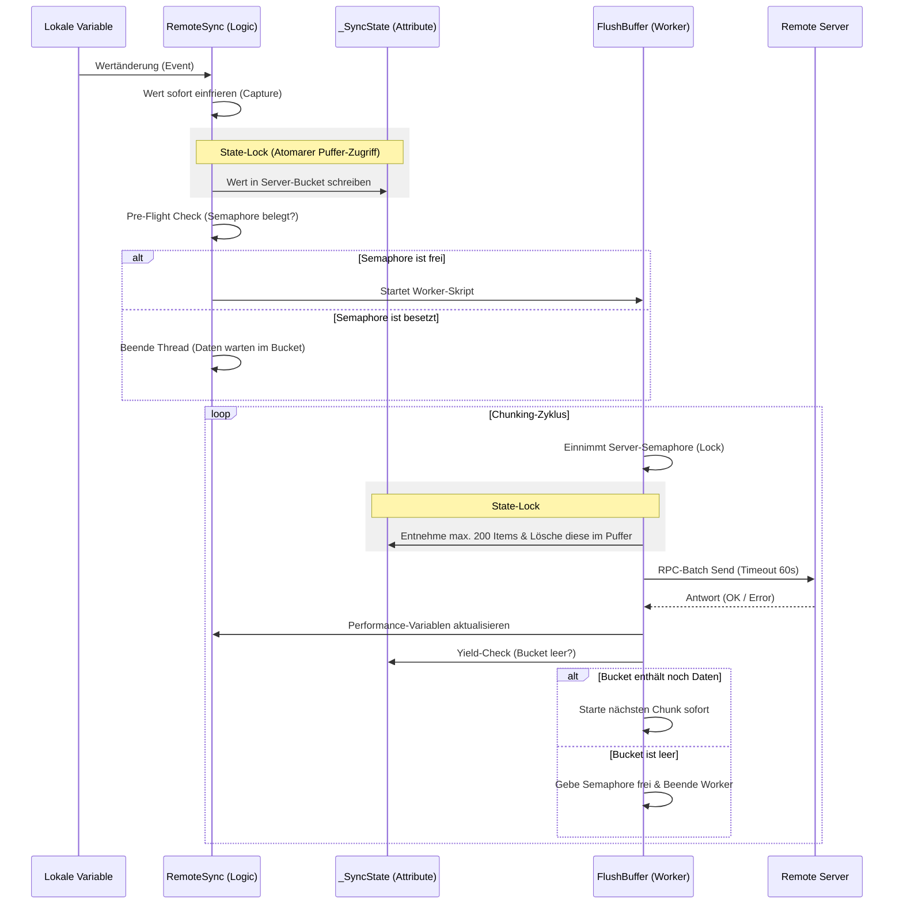
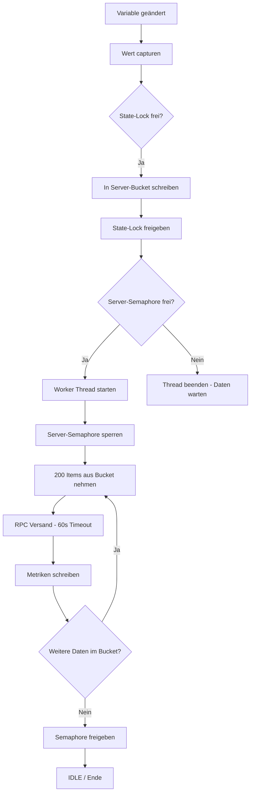

Hier sind die aktualisierten Diagramme, die exakt den aktuellen Stand deines Moduls (**v1.8.2**) abbilden. Alle historischen Zwischenschritte wurden entfernt; dargestellt ist ausschließlich die jetzt aktive Logik.

### 1. Datenfluss-Sequenz (Ereignis bis Remote-Server)
Dieses Diagramm zeigt, wie eine Wertänderung die verschiedenen Schutzschichten (Locks) durchläuft.

### 2. Logik-Übersicht (Entscheidungsbaum)
Dieses Diagramm zeigt die internen Prüfungen, die bei jeder Änderung ablaufen.

### 3. Aktuelle System-Parameter (v1.8.2)

Diese Werte steuern das Verhalten deines "Gold Masters" im Hintergrund:

| Parameter | Aktueller Wert | Funktion |
| :--- | :--- | :--- |
| **Chunk-Limit** | **200 Items** | Maximale Anzahl Variablen pro Netzwerk-Paket. |
| **RPC-Timeout** | **60 Sekunden** | Zeit, die ein Paket maximal zum Senden/Verarbeiten hat. |
| **State-Lock** | 1000 ms | Zeit, die ein Thread wartet, um atomar auf den Puffer zuzugreifen. |
| **Pre-Flight Check** | 0 ms | Verhindert den Start überflüssiger PHP-Skripte bei besetzter Leitung. |
| **Ident-System** | `RS_Gateway` / `RS_Receiver` | Eindeutige Kennung der Skripte auf dem Remote-Server. |

Du kannst diesen Mermaid-Code einfach in VS Code (mit Erweiterung) oder auf [mermaid.live](https://mermaid.live) kopieren, um ihn grafisch zu betrachten. Das System arbeitet jetzt wie eine **getaktete Pumpe**, die deine Daten in kontrollierten 200er-Häppchen durch die Leitung drückt.

Dieses Diagramm verdeutlicht die Architektur der **Version 1.8.2** unter Berücksichtigung aller Optimierungen (Pre-Flight Check, Chunking, State-Locking und 60s Timeout).

### 1. Der Lebenszyklus einer Variablenänderung (Sequenzdiagramm)

Dieses Diagramm zeigt den zeitlichen Ablauf vom Event bis zum Remote-System.

---

### 2. Zeit- und Kapazitäts-Parameter (Übersicht)

Hier sind die kritischen Zeitwerte und Limits, die in v1.8.2 aktiv sind:

| Komponente | Zeit / Limit | Zweck |
| :--- | :--- | :--- |
| **Value Capture** | Millisekunden | Verhindert Race Conditions (v1.6.3) |
| **State-Lock** | Max. 1000ms Wartezeit | Garantiert atomares Lesen/Schreiben der Attribute (v1.6.4) |
| **Pre-Flight Check** | 0ms (sofort) | Verhindert PHP-Thread-Sturm (v1.8.1) |
| **Chunk Size** | **Max. 200 Items** | Verhindert Überlastung der Leitung & senkt den Lag (v1.8.2) |
| **RPC Timeout** | **60 Sekunden** | Gibt langsamen Leitungen Zeit zur Übertragung (v1.7.9) |
| **RTT (Deine Leitung)** | ~800ms - 1500ms | Physische Antwortzeit deiner Internetverbindung |
| **Gefühlter Lag** | ca. 4 - 6 Sekunden | Zeit, bis ein Wert am Ziel ankommt (bei aktiver Pumpe) |

---

### 3. Logische Abhängigkeiten

*   **Identität:** Das Modul findet Remote-Skripte über `RS_Gateway` / `RS_Receiver` (v1.7.8). Dies ist unabhängig vom Namen.
*   **Hierarchie:** Die Variable muss ein Kind des in Schritt 2 definierten Roots sein (`IsChildOf`).
*   **Integrität:** `AddToBuffer` schreibt nur, wenn `Active` in der `SyncList` (RAM-Cache) gesetzt ist.
*   **Abhängigkeit der Locks:** 
    *   Der **State-Lock** ist global pro Instanz (schützt das JSON-Attribut).
    *   Der **Server-Lock (Semaphore)** ist spezifisch pro Folder (schützt die Netzwerkverbindung).

### Zusammenfassung der Architektur v1.8.2
Das System arbeitet nun als **sequentielles Fließband**:
1.  Daten werden in Echtzeit in den Eimer (Bucket) geworfen.
2.  Ein einziger Arbeiter (Worker) nimmt immer nur 200 Stück aus dem Eimer.
3.  Er hat sehr viel Zeit (60s), um diese wegzubringen.
4.  Sobald er zurückkommt, nimmt er sofort die nächsten 200 Stück.

**Dieses Design verhindert den 4-Minuten-Stau, da der "Eimer" nun viel öfter und in handlichen Portionen geleert wird.**

Bist du mit dieser Übersicht zufrieden, oder soll ich einen Teil des Diagramms noch detaillierter aufschlüsseln?
# Dokumentation: RemoteSync (RS) - Hochperformante System-Föderation

## 1. Einführung & Problemstellung
In komplexen IP-Symcon-Umgebungen mit mehreren Standorten (z. B. Haupthaus, Gartenhaus, Büro) stellt die Synchronisation von Daten eine Herausforderung dar. Klassische Lösungen leiden oft unter:

*   **Hoher Netzwerklast:** Viele Einzel-RPC-Aufrufe verzögern das System.
*   **Wartungsaufwand:** Manuelles Anlegen von Variablen und Profilen auf Zielsystemen ist fehleranfällig.
*   **Fehlende Interaktion:** Reine Visualisierung von Werten reicht meist nicht aus; eine Steuerung zurück zum Quellsystem ist oft komplex zu realisieren.

## 2. Die Lösung: Das RemoteSync-Prinzip
RemoteSync fungiert als **intelligente Brücke**, die nicht nur Daten überträgt, sondern die Logik zur Steuerung direkt mitliefert ("Injected Gateway").

*   **Batch-Processing:** Änderungen werden gesammelt und nach einer Ruhepause (200ms) in einem einzigen verschlüsselten Paket übertragen.
*   **Profil-Replikation:** Lokale Variablenprofile werden automatisch auf dem Zielsystem erstellt.
*   **Unified Dashboard:** Ermöglicht die Zusammenführung vieler Quell-Systeme in einer einzigen Benutzeroberfläche (Symcon UI / IPSView), ohne zwischen Servern wechseln zu müssen.

## 3. Datenfluss & Architektur

### A. Synchronisations-Ablauf (Lokal -> Remote)
Geänderte Variablen werden lokal gepuffert und als Batch an das injizierte Empfänger-Skript gesendet.

### B. Das "Unified Dashboard" (N:1 Föderation)
Dies ist der Kernvorteil gegenüber Standardlösungen: Mehrere Standorte werden in einer zentralen Steuereinheit zusammengefasst.

## 4. Parametrisierung

### Schritt 1: Define Remote Targets (Infrastruktur)
Verwaltung der Server-Verbindungen.
*   **Remote Server Key:** Zugangsdaten aus dem Secrets Manager.
*   **Remote Script Root ID:** Kategorie auf dem Zielsystem für die technischen Hilfsskripte.

### Schritt 2: Map Local Roots to Folders (Logik)
Verknüpfung der lokalen Datenbereiche mit den Ziel-Servern.
*   **Local Object (Source):** Die lokale Quell-Kategorie (z. B. "Erdgeschoss").
*   **Remote Root ID:** Die Ziel-Kategorie auf dem entfernten Server.

### Schritt 3: Individual Selection (Auswahl)
Feingranulare Auswahl der Variablen innerhalb der definierten Mappings. Die Gruppierung erfolgt hier nach den lokalen Quell-Objekten aus Schritt 2.
*   **Sync:** Variable wird aktiv gespiegelt.
*   **R-Action:** Aktiviert die Rücksteuerung (Variable wird auf dem Zielsystem schaltbar).
*   **Del Rem.:** Markiert das Objekt zur Löschung auf dem Remote-System.

## 5. Vergleich: RemoteSync vs. Natives IP-Symcon Mirroring

| Feature | Natives IP-Symcon Mirroring | RemoteSync Modul |
| :--- | :--- | :--- |
| **Primärziel** | **Ausfallsicherheit (HA):** Ersatz für defekte Hardware. | **Daten-Föderation:** Vernetzung unabhängiger Systeme. |
| **Umfang** | 1:1 Kopie des gesamten Servers. | Gezielte Auswahl einzelner Variablen/Kategorien. |
| **Richtung** | Unidirektional (Server -> Mirror). | Bidirektional (Werte hin, Befehle zurück). |
| **UI-Szenario** | Ein System ersetzt ein anderes. | **Unified UI:** Viele Systeme in einer Oberfläche. |
| **Kosten** | Kostenpflichtige Extension. | Kostenloses PHP-Modul. |

Hier ist die ergänzte Zusammenfassung für deine Dokumentation, die den entscheidenden Unterschied zwischen dem nativen „Voll-Import“ und deinem „selektiven Push“ hervorhebt.

---

### **Zusammenfassung: RemoteSync (RS) vs. Natives Sync Remote**

**Das Kernkonzept: Selective-Push vs. Full-Inclusion**
Während das native IP-Symcon Modul „Sync Remote“ (ab v7.1) darauf ausgelegt ist, einen entfernten Client **vollständig** in einen Server zu integrieren (Full-Inclusion), verfolgt **RemoteSync** den Ansatz des **Selective-Push**. 

Hierbei bestimmt die Quelle chirurgisch genau, welche Daten geteilt werden. Dies macht RemoteSync zur idealen Lösung für die **System-Föderation** und den Aufbau von **Zentral-Dashboards**.

#### **Die wichtigsten Unterschiede im Überblick**

| Merkmal | IP-Symcon "Sync Remote" (Nativ) | RemoteSync (Dieses Modul) |
| :--- | :--- | :--- |
| **Philosophie** | **Full-Inclusion:** Der Server "holt" sich den gesamten Objektbaum des Clients. | **Selective-Push:** Die Quelle "sendet" nur explizit gewählte Variablen an das Ziel. |
| **Richtung** | Server zieht vom Client (Pull). | Quelle drückt zum Ziel (Push). |
| **Ressourcen** | Hohe Last durch Synchronisation des gesamten Baums. | Extrem effizient durch Batch-Verarbeitung nur gewählter Daten. |
| **Anwendung** | Master-Slave Integration ganzer Systeme. | **Unified Dashboard:** N:1 Kopplung vieler Standorte. |
| **Kosten** | Kostenpflichtige Lizenz-Erweiterung. | Kostenloses PHP-Modul. |

#### **Der entscheidende Vorteil: Das Unified Dashboard (N:1)**
Der größte Mehrwert von RemoteSync liegt in der Möglichkeit, ein **zentrales User-Interface (Symcon UI / IPSView)** für beliebig viele verteilte Systeme zu erstellen:

1.  **Zentralisierung:** Daten von 10 verschiedenen Standorten können auf einem einzigen, kostengünstigen Visualisierungs-Server zusammengeführt werden.
2.  **Volle Interaktivität:** Dank der injizierten Gateway-Logik sind entfernte Variablen im zentralen Dashboard nicht nur sichtbar, sondern verhalten sich wie lokale Geräte (inkl. Rücksteuerung per `RequestAction`).
3.  **Datenschutz & Kontrolle:** Im Gegensatz zum Voll-Import verbleibt die Datenhoheit beim Quellsystem. Es wird nur das übertragen, was für die Zentrale relevant ist.
4.  **Effizienz:** Durch die Batch-Übertragung und den Verzicht auf den Import tausender irrelevanter System-Objekte bleibt die Performance der Visualisierung auch bei schmalbandigen Verbindungen (z. B. LTE) erhalten.

**Fazit**
RemoteSync ist kein Ersatz für ein Full-Recovery-Szenario, sondern das spezialisierte Werkzeug für Anwender, die **unabhängige Systeme intelligent vernetzen** und in einer **gemeinsamen Oberfläche steuern** wollen.

---

Diese Zusammenfassung macht sofort klar, warum man sich trotz einer nativen Lösung für dein Modul entscheiden sollte: **Effizienz, Selektivität und Kostenfreiheit.**

## 6. Sicherheitshinweise
*   **Secrets Manager:** Das Modul speichert keine Passwörter. Alle Credentials werden über das SEC-Modul (Password Vault) bezogen.
*   **Verschlüsselung:** Die Kommunikation erfolgt ausschließlich über TLS-verschlüsseltes HTTPS.
*   **Referenz-Schutz:** Variablen werden auf dem Zielsystem über das Feld `ObjectInfo` (`RS_REF:Key:ID`) eindeutig identifiziert, was die Synchronisation immun gegen Umbenennungen macht.
